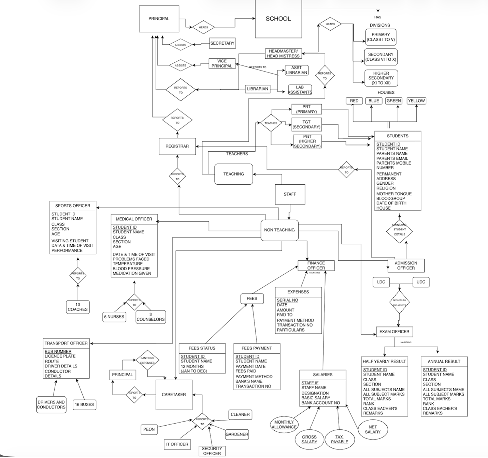

# School-database

# MBA Final Project: Integrated School Management System (ISMS)

# Project Overview
This project involves the design and implementation of a comprehensive relational database for a K-12 educational institution. The system manages complex organizational hierarchies, multi-departmental financial operations, academic performance tracking, and ancillary services like transport and healthcare.

# Business Scenarios & Logic
The database is architected to handle the following real-world administrative scenarios:
# 1. Organizational Hierarchy & Staffing
  •	Role-Based Access: Manages a diverse staff including Teaching (PRT, TGT, PGT) and Non-Teaching personnel (Librarians, Finance Officers, Medical Staff).
  •	Reporting Lines: Implements logic where specific roles report to the Principal, Vice-Principal, or Registrar, mirroring a corporate organizational chart.
# 2. Financial Management & Payroll
  •	Automated Payroll: The Salary table uses calculated fields to determine Gross Salary, Tax Liabilities based on income slabs, and Net Pay.
  •	Revenue Tracking: Monitors student fees across 12 months with a strict "No Cash" policy, ensuring audit trails through transaction IDs and digital payment methods.
  •	Expense Auditing: Every school expense is logged with unique serial numbers and requires Principal sanctioning, demonstrating an understanding of internal controls.
# 3. Academic & Student Administration
  •	Unique Identification: Implements a smart Student ID system (e.g., 20250010) that encodes the admission year and roll sequence.
  •	Result Tabulation: A multi-tier reporting workflow where marks flow from Subject Teachers → Class Teachers → Headmasters → Examination Officers.
# 4. Operations & Logistics
  •	Fleet Management: A Bus table manages routes and driver/conductor licensing for 16 vehicles.
  •	Health & Sports Analytics: Dedicated modules for tracking student health metrics (BP, Temperature) and sports performance over time.
  
# Technical SQL Features Used
• Data Definition (DDL): Created complex table structures with primary keys, foreign keys, and unique constraints. 
• Data Manipulation (DML): Performed updates for annual appraisals and monthly fee status toggles. 
• Advanced Queries: 
    o Joins: Connecting Staff and Salary for payroll; Admission and Fees for financial reporting. 
    o Aggregate Functions: SUM() and AVG() for departmental expense reports and class ranking. 
    o Conditional Logic: Used CASE statements to automate "Paid/Unpaid" status and Tax Slab calculations.

# Database Schema (Highlights)
  •	Admission: Comprehensive student PII and House assignments.
  •	HY/Annual Results: Academic performance and ranking data.
  •	Fees Status: 12-month financial tracking for every student.
  •	Staff & Salary: HR management and automated payroll processing.
  •	Health Checkup: Clinical records for student visits.

## Database Files

* 📄 **Database Script:** [Download SQL Schema File](education-dbms.sql)
* 📊 **Entity Relationship Diagram:**

